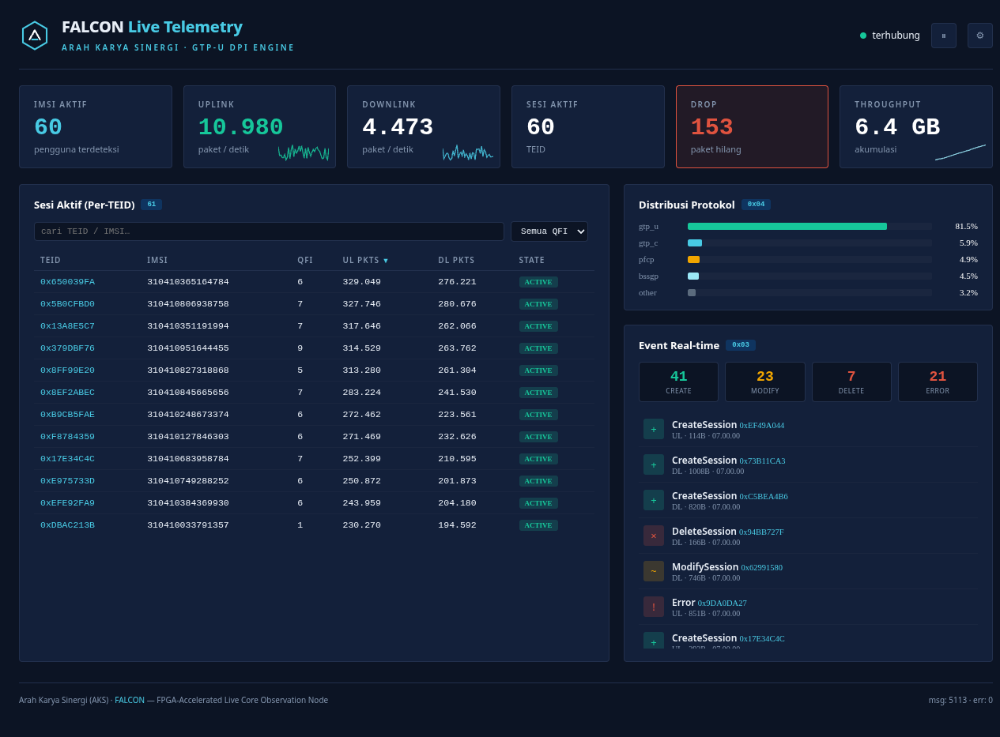
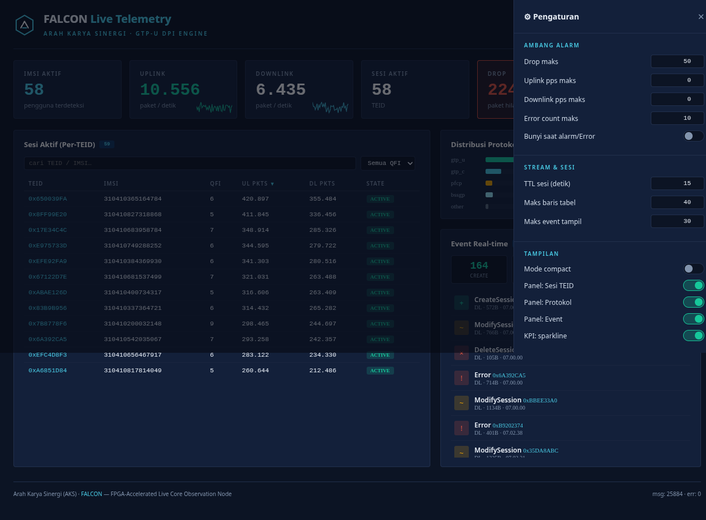

<div align="center">

# FALCON — FPGA-Accelerated Live Core Observation Node

**Line-rate GTP-U telemetry, observed live.**

[](https://falcon.arahkarya.com)
[](https://github.com/ArahKarya/falcon)
[](LICENSE)
[](https://www.python.org/)
[]()
[]()

</div>

> Sistem monitoring **GTP-U Deep Packet Inspection (DPI)** real-time, diakselerasi **FPGA**.
> Kolaborasi **NOZ × Arah Karya Sinergi (AKS)**.

Telemetry dari akselerator **FPGA** — yang mem-*parse* paket **GTP-U** pada *line-rate* di plane jaringan seluler (4G/5G) — di-stream sebagai datagram **UDP** ringkas ke backend host, di-decode menjadi state, lalu **di-push live** ke dashboard web. Tujuannya: observabilitas trafik core network **tanpa membebani CPU** (parsing berat dikerjakan gateware FPGA, host hanya mengoordinasi & menyajikan).

FALCON dipecah jadi **kontrak byte tunggal** yang dipakai bersama oleh sumber data dan konsumen. Selama board FPGA fisik masih dikembangkan di NOZ, sebuah **Simulator** menghasilkan telemetry realistis dengan kontrak byte **identik** — sehingga seluruh stack host (backend + dashboard) bisa dibangun & diuji **tanpa hardware**. Saat board datang: matikan simulator, arahkan FPGA kirim ke `:50000`, **tidak ada kode host yang berubah**.

## ✨ Kenapa FALCON

| Masalah | Solusi FALCON |
|---|---|
| Parsing GTP-U line-rate membebani CPU host | **FPGA** mem-parse di hardware; host hanya terima ringkasan telemetry |
| Telemetry biner sulit dibaca / rawan desync | **Kontrak byte tunggal** (`contract.py`) dipakai bersama pengirim & penerima — zero desync |
| Datagram rusak bisa crash collector | **Malformed-safe**: datagram cacat di-skip + dihitung, proses tetap hidup |
| Butuh lihat kondisi jaringan seketika | **WebSocket push** — KPI, sesi per-TEID, event, distribusi protokol live |
| Hardware belum tersedia saat develop | **Simulator** dengan kontrak byte identik → bangun & uji full stack tanpa board |
| Operator butuh kontrol & ambang sendiri | **Dashboard konfigurabel**: alarm threshold, filter, sort, pause, sparkline (per-device) |

## 📸 Tampilan

> 🟢 **Demo live:** [falcon.arahkarya.com](https://falcon.arahkarya.com) — diekspos via Cloudflare tunnel.

| Dashboard live | Panel konfigurasi |
|---|---|
|  |  |
| KPI + sesi per-TEID + protokol + event real-time | Ambang alarm, stream, tampilan — tersimpan di browser |

Tema **Hermes Dashboard** (flat: warna solid, border 1px, sudut tajam, mono untuk angka — **tanpa glow/neon/wire**).

## 🏛️ Arsitektur

```
┌──────────────┐   UDP :50000     ┌──────────────┐  WebSocket/REST :8080  ┌───────────┐
│  FPGA board  │ ───telemetry───▶ │   BACKEND    │ ───────live push─────▶ │ DASHBOARD │
│      atau    │   (0x01–0x04)    │  (aiohttp)   │                        │  (web UI) │
│  SIMULATOR   │ ◀──ingest :9000──│ decode+state │  REST snapshot/history │           │
└──────────────┘                  └──────────────┘                        └───────────┘
        │                                │                                       │
   pack contract.py              shared/contract.py                       wss:// auto (HTTPS)
```

Kontrak byte (`falcon/shared/contract.py`) adalah **single source of truth** — pengirim
(FPGA/Simulator) dan penerima (Backend) meng-*encode*/*decode* dengan modul yang sama.

## 🔁 Pipeline (1 datagram)

```
UDP datagram → parse_header (4B) → dispatch by msg_type → unpack payload
            → update in-memory state → broadcast WebSocket → render dashboard
   (malformed → err_count++, di-skip, proses tetap hidup)
```

## 🧬 Kontrak Byte Telemetry

Common header **4 byte**, semua multi-byte **big-endian** (network order).
*Proposal AKS — field/offset final menunggu konfirmasi NOZ.*

```
Header (4B):  msg_type(u8) · version(u8) · length(u16)
```

| Tipe | ID | Payload | Isi |
|---|---|---|---|
| **Global** | `0x01` | 64B | `total_imsi · uplink_pps · downlink_pps · active_teid · total_bytes(u64) · drop_count · ts` |
| **Per-TEID** | `0x02` | 48B | `teid · imsi[16] · qfi · state · ul_pkts · dl_pkts` |
| **Event** | `0x03` | 32B | `event_type · direction · teid · packet_len · ts` |
| **Protocol** | `0x04` | 32B | distribusi `gtp_u · gtp_c · pfcp · bssgp · other` (basis 10000 → persen) |

Enum: event `{1:Create, 2:Delete, 3:Modify, 4:Error}` · state `{0:IDLE, 1:ACTIVE, 2:SUSPENDED}` · direction `{0:UL, 1:DL}`.

Self-test roundtrip (pack → decode):
```bash
python -m falcon.shared.contract
```

## 🌐 API

**WebSocket** `ws(s)://<host>:8080/ws` — frame JSON; snapshot awal saat connect, lalu push per-update.
Dashboard memilih `wss://` otomatis saat HTTPS (hindari mixed-content).

```jsonc
// contoh frame
{ "type": "teid",   "data": { "teid":"0x650039FA", "imsi":"310410365164784", "qfi":6,
                              "state":"ACTIVE", "ul_pkts":401648, "dl_pkts":337763 } }
{ "type": "event",  "data": { "event":"ModifySession", "direction":"UL",
                              "teid":"0xC41413C1", "packet_len":549, "ts":1781913634 },
                    "counter": { "CreateSession":38, "ModifySession":23, ... } }
```

**REST**

| Endpoint | Fungsi |
|---|---|
| `GET /api/health` | status, uptime, msg/err count |
| `GET /api/stats/global` | KPI global terkini (`0x01`) |
| `GET /api/stats/teid` | array sesi per-TEID aktif (`0x02`) |
| `GET /api/events?limit=N` | event terakhir (`0x03`) |
| `GET /api/events/counter` | jumlah event per-tipe |
| `GET /api/stats/protocol` | distribusi protokol (`0x04`) |
| `GET /api/history` | ring-buffer ~120 titik (sparkline) |
| `GET /api/snapshot` | seluruh state sekaligus |
| `GET /api/version` | nama, versi, port |

## 🎛️ Fitur Dashboard

Konfigurasi tersimpan di browser (`localStorage`) — per-device, tanpa backend write.

| Kategori | Fitur |
|---|---|
| **Kontrol** | Pause/Resume stream (bekukan tampilan), panel Settings (⚙) |
| **Alarm** | Ambang Drop / UL pps / DL pps / Error → kartu KPI **flash merah** + opsi bunyi |
| **Tabel TEID** | Search (TEID/IMSI), filter QFI, sort tiap kolom, klik baris → **modal detail sesi** |
| **Visual** | **Sparkline** UL/DL/Throughput, bar protokol, **counter event** per-tipe |
| **Tampilan** | Mode compact, toggle tiap panel, toggle sparkline, TTL sesi & limit baris/event |

## 📁 Struktur Repo

```
falcon/                       # repo root
├── README.md
├── LICENSE                    # MIT
├── falcon/
│   ├── shared/
│   │   └── contract.py        # kontrak byte 0x01–0x04 (pack/unpack, single source of truth)
│   ├── simulator/
│   │   └── sim.py             # tiru output FPGA → telemetry UDP :50000
│   ├── backend/
│   │   └── server.py          # aiohttp: UDP listener + WebSocket + REST + serve dashboard
│   └── dashboard/
│       └── index.html         # UI real-time (vanilla HTML/CSS/JS, tema Hermes Dashboard)
├── docs/
│   ├── BRD-FALCON.pdf         # Business Requirements
│   ├── PRD-FALCON.pdf         # Product Requirements (byte struct, API, AC)
│   ├── FPGA-Diagram.pdf       # diagram arsitektur & metode ingest
│   ├── screenshots/           # tampilan dashboard
│   └── *.md                   # sumber Markdown
└── source-pdf/                # dokumen sumber asli dari NOZ (FPGA spec + readme)
```

## 🔌 Port

| Arah | Port | Keterangan |
|---|---|---|
| Host → FPGA | UDP `9000` | ingest (hardware-locked) |
| FPGA → Host | UDP `50000` | telemetry (host listening) |
| Backend HTTP/WS | TCP `8080` | dashboard + REST + WebSocket |

## 🚀 Quickstart

```bash
cd ~/apps/fpga-dpi
python3 -m venv .venv && source .venv/bin/activate
pip install aiohttp
```

> **Catatan host RPi5:** `terminal(background=true)` rusak (`open terminal failed`).
> Jalankan long-lived process via **tmux detached**.

```bash
# 1. backend (serve dashboard + API + WebSocket :8080, listen telemetry :50000)
tmux new-session -d -s falcon-be  ". .venv/bin/activate && python -m falcon.backend.server"

# 2. simulator (pengganti FPGA — kirim telemetry ke :50000)
tmux new-session -d -s falcon-sim ". .venv/bin/activate && python -m falcon.simulator.sim"

# 3. buka dashboard → http://127.0.0.1:8080/
curl -s http://127.0.0.1:8080/api/health
```

Operasi:
```bash
tmux ls                              # lihat session aktif
tmux capture-pane -t falcon-be -p | tail   # baca log backend
tmux kill-session -t falcon-sim      # stop simulator
```

Simulator menerima opsi: `--host`, `--port`, `--rate` (multiplier trafik/event).

## ✅ Status

- [x] **BRD + PRD + diagram** lengkap (`docs/`)
- [x] **Kontrak byte** `0x01`–`0x04` (pack/unpack, roundtrip teruji)
- [x] **Simulator** — generate 4 tipe telemetry realistis, UDP :50000
- [x] **Backend** — aiohttp UDP listener + WebSocket + REST, **malformed-safe**
- [x] **Dashboard v1.1** — KPI, tabel TEID, protokol, event + **konfigurasi lengkap** (alarm, filter, sort, sparkline, pause, detail sesi)
- [x] **Deploy publik** — Cloudflare tunnel → [falcon.arahkarya.com](https://falcon.arahkarya.com)
- [ ] **Custom firmware FPGA** — gateware GTP-U DPI (in progress)
- [ ] Integrasi board fisik (swap simulator → FPGA), konfirmasi byte-struct dengan NOZ

## 🛠️ Saat FPGA asli datang

1. Konfirmasi field/offset byte dengan NOZ → patch `falcon/shared/contract.py` bila beda.
2. `tmux kill-session -t falcon-sim`.
3. Arahkan FPGA kirim telemetry ke host `:50000`. **Backend & dashboard tak berubah.**

## 🧱 Stack

Python **3.13** async (`aiohttp` + WebSocket). State **in-memory** (PoC, tanpa DB eksternal).
Dashboard: **vanilla** HTML/CSS/JS (tanpa build step), tema **Hermes Dashboard** (navy + teal/cyan, mono).

---

<div align="center">
<sub>© 2026 Arah Karya Sinergi (AKS) × NOZ · FALCON</sub>
</div>
